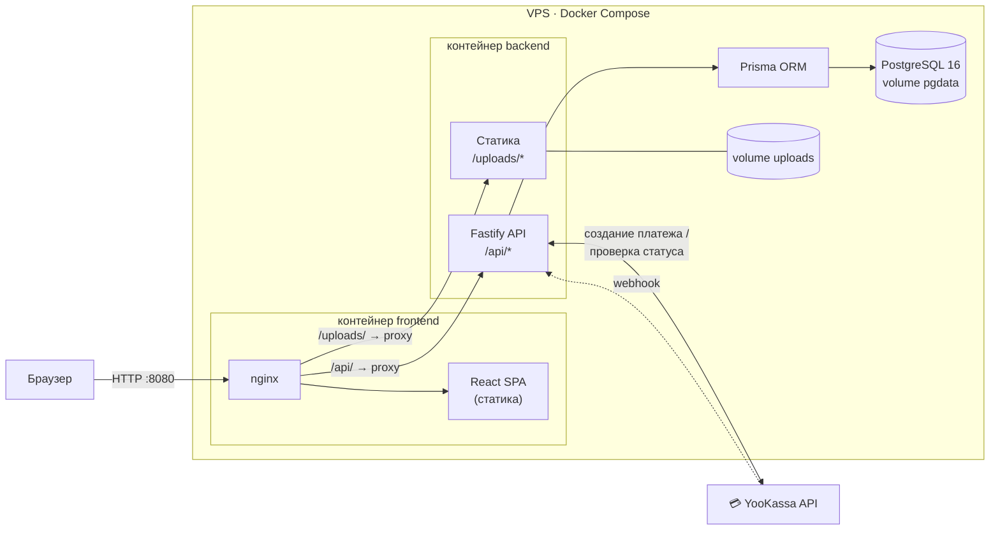
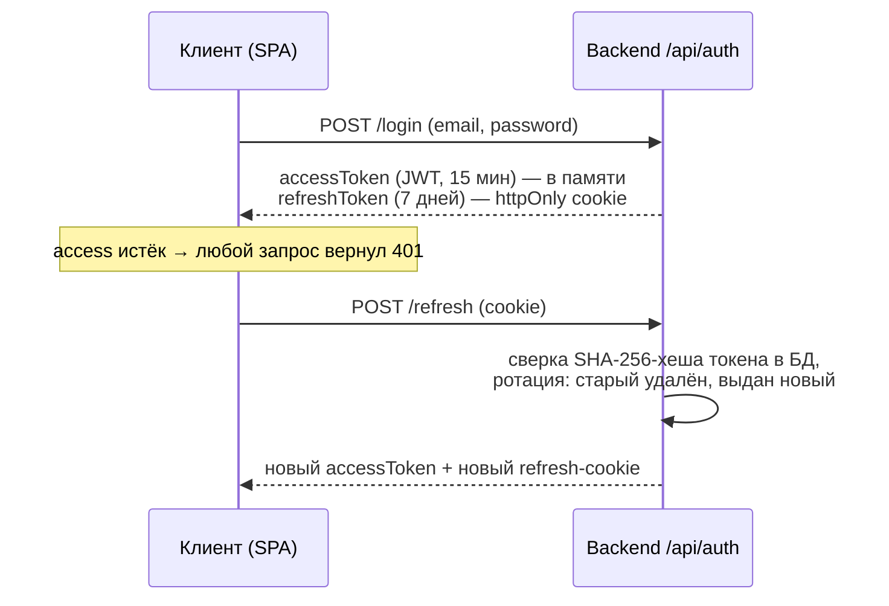
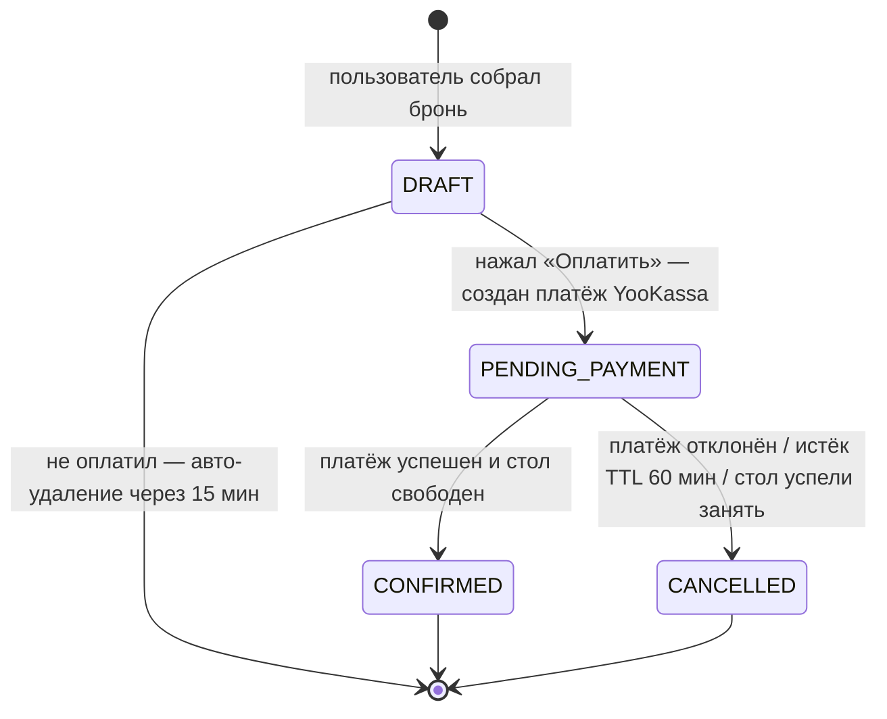
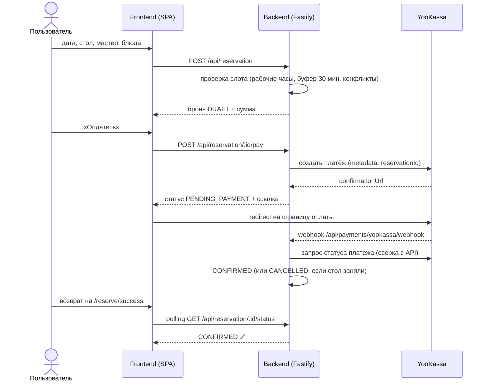

# Архитектура

## Общая схема



## Backend

Каждый модуль устроен одинаково:

```
route → service → repository
```

## Frontend

Feature-Sliced Design, направление импортов контролируется линтером:

```
app
 └─> pages
      └─> widgets
           └─> features
                └─> entities
                     └─> shared
```

## Аутентификация



## Бизнес-процесс: бронирование и оплата

### Статусная модель брони



### Последовательность оплаты



Занятость стола проверяется трижды: при выборе, перед созданием платежа и после его подтверждения — конфликт на последнем шаге отменяет бронь.
