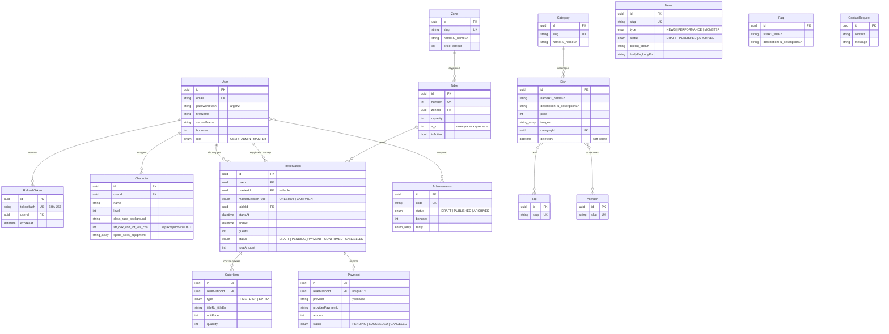

# ERD-диаграмма

```mermaid
erDiagram
    User ||--o{ RefreshToken : "сессии"
    User ||--o{ Character : "владеет"
    User ||--o{ Reservation : "бронирует"
    User ||--o{ Reservation : "ведёт как мастер"
    User }o--o{ Achievements : "получил"

    Zone ||--o{ Table : "содержит"
    Table ||--o{ Reservation : "занят"

    Reservation ||--o{ OrderItem : "состав заказа"
    Reservation ||--o| Payment : "оплата"

    Category ||--o{ Dish : "категория"
    Dish }o--o{ Tag : "теги"
    Dish }o--o{ Allergen : "аллергены"

    User {
        uuid id PK
        string email UK
        string passwordHash "argon2"
        string firstName
        string secondName
        int bonuses
        enum role "USER | ADMIN | MASTER"
    }

    RefreshToken {
        uuid id PK
        string tokenHash UK "SHA-256"
        uuid userId FK
        datetime expiresAt
    }

    Reservation {
        uuid id PK
        uuid userId FK
        uuid masterId FK "nullable"
        enum masterSessionType "ONESHOT | CAMPAIGN"
        uuid tableId FK
        datetime startsAt
        datetime endsAt
        int guests
        enum status "DRAFT | PENDING_PAYMENT | CONFIRMED | CANCELLED"
        int totalAmount
    }

    OrderItem {
        uuid id PK
        uuid reservationId FK
        enum type "TIME | DISH | EXTRA"
        string titleRu_titleEn
        int unitPrice
        int quantity
    }

    Payment {
        uuid id PK
        uuid reservationId FK "unique 1:1"
        string provider "yookassa"
        string providerPaymentId
        int amount
        enum status "PENDING | SUCCEEDED | CANCELED"
    }

    Table {
        uuid id PK
        int number UK
        uuid zoneId FK
        int capacity
        int x_y "позиция на карте зала"
        bool isActive
    }

    Zone {
        uuid id PK
        string slug UK
        string nameRu_nameEn
        int pricePerHour
    }

    Dish {
        uuid id PK
        string nameRu_nameEn
        string descriptionRu_descriptionEn
        int price
        string_array images
        uuid categoryId FK
        datetime deletedAt "soft delete"
    }

    Category {
        uuid id PK
        string slug UK
        string nameRu_nameEn
    }

    Tag {
        uuid id PK
        string slug UK
    }

    Allergen {
        uuid id PK
        string slug UK
    }

    Character {
        uuid id PK
        uuid userId FK
        string name
        int level
        string class_race_background
        int str_dex_con_int_wis_cha "характеристики D&D"
        string_array spells_skills_equipment
    }

    Achievements {
        uuid id PK
        string code UK
        enum status "DRAFT | PUBLISHED | ARCHIVED"
        int bonuses
        enum_array rarity
    }

    News {
        uuid id PK
        string slug UK
        enum type "NEWS | PERFORMANCE | MONSTER"
        enum status "DRAFT | PUBLISHED | ARCHIVED"
        string titleRu_titleEn
        string bodyRu_bodyEn
    }

    Faq {
        uuid id PK
        string titleRu_titleEn
        string descriptionRu_descriptionEn
    }

    ContactRequest {
        uuid id PK
        string contact
        string message
    }
```
